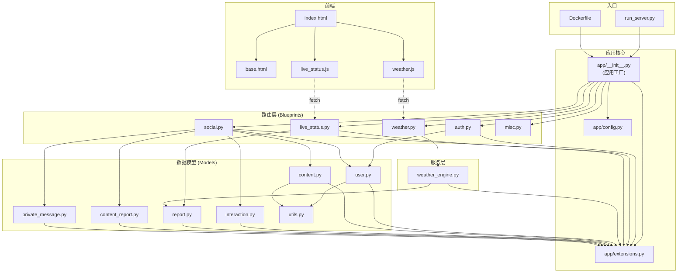
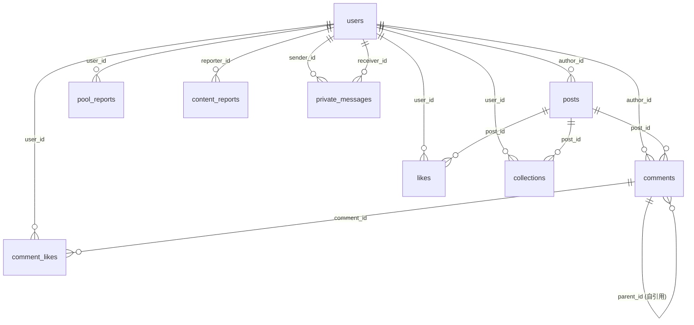

# NTU Swimming Pool Web — 项目文件规格说明 (FileSpec)

> 本文档列出项目中每个文件/目录的职责，以及它们之间的关键依赖关系。

---

## 目录结构总览

```
Swim_Pool_Web_Dev/
├── app/                        # Flask 应用主包
│   ├── __init__.py             # 应用工厂 & 蓝图注册
│   ├── config.py               # 配置类（开发/生产/测试）
│   ├── extensions.py           # Flask 扩展实例（db, mail, login_manager）
│   ├── blueprints/             # 路由层（按功能拆分蓝图）
│   │   ├── auth.py             # 认证蓝图（注册/登录/OTP/密码重置）
│   │   ├── social.py           # 社区蓝图（帖子/评论/点赞/收藏/私信/管理）
│   │   ├── weather.py          # 天气 API 蓝图
│   │   ├── live_status.py      # 社区实时状态上报 API 蓝图
│   │   └── misc.py             # 杂项蓝图（储物柜等占位）
│   ├── models/                 # 数据模型层（SQLAlchemy ORM）
│   │   ├── __init__.py         # 统一导出所有模型
│   │   ├── utils.py            # TimestampMixin（created_at / updated_at）
│   │   ├── user.py             # User 模型
│   │   ├── content.py          # Post & Comment 模型
│   │   ├── interaction.py      # Like / Collection / CommentLike 模型
│   │   ├── report.py           # PoolReport 模型（泳池状态用户上报）
│   │   ├── content_report.py   # ContentReport 模型（内容举报）
│   │   └── private_message.py  # PrivateMessage 模型（私信）
│   ├── services/               # 业务服务层
│   │   ├── __init__.py         # 空包初始化
│   │   └── weather_engine.py   # 天气引擎（NEA API 闪电/降雨 + Haversine）
│   ├── static/                 # 静态资源
│   │   ├── input.css           # Tailwind CSS 输入文件
│   │   ├── img/
│   │   │   └── logo.png        # 网站 Logo
│   │   └── js/
│   │       ├── weather.js      # 前端天气状态轮询 & UI 更新
│   │       └── live_status.js  # 前端社区实时上报轮询 & UI 更新
│   └── templates/              # Jinja2 模板
│       ├── base.html           # 全局基础布局（导航栏、TailwindCDN）
│       ├── index.html          # 首页（天气仪表盘 + 社区上报）
│       ├── auth/               # 认证页面模板
│       │   ├── login.html
│       │   ├── register.html
│       │   ├── verify_otp.html
│       │   ├── unverified.html
│       │   ├── reset_request.html
│       │   └── reset_password.html
│       └── social/             # 社区页面模板
│           ├── feed.html           # 帖子列表（社区首页）
│           ├── create_post.html    # 发帖页
│           ├── edit_post.html      # 编辑帖子页
│           ├── post_detail.html    # 帖子详情（含评论）
│           ├── profile.html        # 个人主页（帖子/收藏/私信）
│           ├── profile_edit.html   # 编辑个人资料
│           ├── messages.html       # 私信会话列表
│           ├── chat.html           # 单条私信对话
│           └── admin_reports.html  # 管理员举报审核页
├── tests/                      # 测试文件
│   ├── test_haversine.py       # Haversine 公式单元测试
│   ├── test_profile_flow.py    # 用户资料流程测试
│   ├── verify_rainfall.py      # 降雨数据验证脚本
│   ├── sample_nea_lightning_data.json  # 闪电 API 样例数据
│   └── sample_nea_rainfall_data.json   # 降雨 API 样例数据
├── instance/                   # Flask 实例目录（SQLite 数据库等）
├── run_server.py               # 开发服务器启动入口
├── init_db.py                  # 初始化数据库（create_all）
├── reset_db.py                 # 重置数据库（DROP + CREATE）
├── requirements.txt            # Python 依赖清单
├── Dockerfile                  # Docker 多阶段构建（生产镜像）
├── docker-compose.yml          # Docker Compose（本地 web + PostgreSQL）
├── deploy.bat                  # GCR 全量部署脚本
├── deploy_update.bat           # GCR 增量更新脚本
├── deploy.ps1                  # PowerShell 版部署脚本
├── tailwind.config.js          # Tailwind CSS 配置
├── .env / .env.example         # 环境变量（密钥、数据库、邮件服务）
├── .gitignore                  # Git 忽略规则
├── .dockerignore               # Docker 忽略规则
├── README.md                   # 项目说明文档
└── product*.md                 # 产品需求文档（按版本拆分）
```

---

## 各文件详细说明

### 根目录文件

| 文件 | 职责 | 关键依赖 |
|------|------|----------|
| `run_server.py` | 开发环境启动入口，调用 `create_app()` 创建应用并在 5001 端口运行。首次启动时自动建表并创建测试用户。 | `app/__init__.py`, `app/models/user.py` |
| `init_db.py` | 一次性数据库初始化脚本，执行 `db.create_all()` 创建全部数据表。 | `app/__init__.py`, `app/models/*` |
| `reset_db.py` | 危险操作脚本：DROP 整个 public schema 后重建所有表（用于开发环境重置）。 | `app/__init__.py`, `app/extensions.py` |
| `requirements.txt` | Python 依赖声明，包括 Flask、SQLAlchemy、Flask-Login、Flask-Mail、psycopg2、gunicorn 等。 | — |
| `Dockerfile` | 多阶段 Docker 构建，最终使用 gunicorn 启动，暴露 8080 端口供 Cloud Run 使用。 | `requirements.txt`, `app/` |
| `docker-compose.yml` | 本地开发编排：Flask web 服务 + PostgreSQL 15 数据库。 | `Dockerfile` |
| `deploy.bat` | Windows BAT 脚本，执行 GCR 全量构建镜像 → 部署到 Cloud Run → 输出 URL。 | Google Cloud SDK |
| `deploy_update.bat` | 增量更新脚本，使用 Artifact Registry 推送镜像后部署。 | Google Cloud SDK |
| `deploy.ps1` | PowerShell 版部署脚本，功能与 `deploy.bat` 类似。 | Google Cloud SDK |
| `tailwind.config.js` | Tailwind CSS 配置，指定 content 扫描范围为 `app/templates/**/*.html`。 | — |
| `.env` / `.env.example` | 环境变量配置：`SECRET_KEY`、`DATABASE_URL`、`MAIL_*`、`NEA_API_KEY` 等。 | — |
| `product*.md` | 产品需求文档（product1.md ~ product3.md、product2.1 ~ 2.5），记录各版本功能规格。 | — |

---

### `app/__init__.py` — 应用工厂

**职责**：创建 Flask 应用实例，初始化扩展，注册所有蓝图，定义全局路由(`/`)和上下文处理器（注入未读私信数量）。

**依赖关系**：
```
app/__init__.py
  ├── 导入 → app/config.py (加载配置)
  ├── 导入 → app/extensions.py (初始化 db, mail, login_manager)
  ├── 注册 → app/blueprints/weather.py
  ├── 注册 → app/blueprints/auth.py
  ├── 注册 → app/blueprints/social.py
  ├── 注册 → app/blueprints/misc.py
  ├── 注册 → app/blueprints/live_status.py
  └── 使用 → app/models/private_message.py (未读消息计数)
```

---

### `app/config.py` — 配置类

**职责**：定义 `Config`（基础）、`DevelopmentConfig`、`ProductionConfig`、`TestingConfig` 四个配置类。从环境变量读取数据库 URI、邮件服务配置、NEA API Key 等。

**依赖关系**：
- 读取 `.env` 文件（通过 `python-dotenv`）
- 被 `app/__init__.py` 使用

---

### `app/extensions.py` — Flask 扩展

**职责**：集中创建 `SQLAlchemy`、`Mail`、`LoginManager` 实例，定义 `user_loader` 回调。

**依赖关系**：
- 被 `app/__init__.py` 导入并初始化
- 被所有 models 和 blueprints 导入使用（`db`, `mail`）
- `user_loader` 回调导入 `app/models/user.py`

---

### `app/blueprints/auth.py` — 认证蓝图

**职责**：处理用户注册、登录、登出、OTP 验证、密码重置等认证流程。路由前缀 `/auth`。

| 路由 | 功能 |
|------|------|
| `/auth/register` | 注册 + 发送 OTP |
| `/auth/login` | 登录 |
| `/auth/logout` | 登出 |
| `/auth/verify-otp` | OTP 验证 |
| `/auth/resend-confirmation` | 重发验证码 |
| `/auth/reset-request` | 请求密码重置 |
| `/auth/reset-password` | 重置密码 |

**依赖关系**：
```
auth.py
  ├── app/models/user.py (User 模型)
  ├── app/extensions.py (db, mail)
  └── templates/auth/*.html (6 个认证模板)
```

---

### `app/blueprints/social.py` — 社区蓝图

**职责**：社区全部功能的路由处理，包括帖子 CRUD、评论（含嵌套回复）、点赞、收藏、举报、管理员操作（置顶/封禁/审核举报）、个人资料编辑、私信系统。路由前缀 `/social`。

**依赖关系**：
```
social.py
  ├── app/models/content.py (Post, Comment)
  ├── app/models/interaction.py (Like, Collection, CommentLike)
  ├── app/models/content_report.py (ContentReport)
  ├── app/models/private_message.py (PrivateMessage)
  ├── app/models/user.py (User)
  ├── app/extensions.py (db)
  └── templates/social/*.html (9 个社区模板)
```

---

### `app/blueprints/weather.py` — 天气 API 蓝图

**职责**：提供 `/weather/status` JSON API，调用天气引擎返回泳池开放状态。

**依赖关系**：
```
weather.py
  └── app/services/weather_engine.py (weather_engine 单例)
```

---

### `app/blueprints/live_status.py` — 社区实时状态蓝图

**职责**：提供 `/api/live-status/` REST API（GET 获取最近上报 / POST 提交上报），支持用户众包报告泳池状态。

**依赖关系**：
```
live_status.py
  ├── app/models/report.py (PoolReport)
  └── app/extensions.py (db)
```

---

### `app/blueprints/misc.py` — 杂项蓝图

**职责**：占位蓝图，目前仅包含 `/locker` 路由，返回纯文本 "Locker Status"。

**依赖关系**：无

---

### `app/models/` — 数据模型层

#### `models/__init__.py`
统一导出所有模型类，方便其他模块通过 `from app.models import ...` 使用。

#### `models/utils.py`
提供 `TimestampMixin` Mixin 类，自动为模型添加 `created_at` 和 `updated_at` 字段。

#### `models/user.py` — User 模型
| 字段 | 说明 |
|------|------|
| `email`, `username`, `password_hash` | 基础账户信息 |
| `is_verified` | 邮箱是否已验证 |
| `role` / `is_banned` | 角色（user/admin）和封禁状态 |
| `nickname`, `avatar`, `avatar_mimetype` | 个人资料 |
| `otp_code`, `otp_expiry` | OTP 验证码及过期时间 |

**依赖**：`extensions.py`（db）, `utils.py`（TimestampMixin）, `flask_login.UserMixin`, `itsdangerous`

#### `models/content.py` — Post & Comment 模型
- **Post**：帖子，支持软删除、置顶、分类（general/squad/lostfound/tutorial）、浏览计数。
- **Comment**：评论，支持软删除、楼中楼回复（`parent_id` 自引用）。

**依赖**：`extensions.py`, `utils.py`

#### `models/interaction.py` — 交互模型
- **Like**：帖子点赞（唯一约束 user_id + post_id）
- **Collection**：帖子收藏（唯一约束 user_id + post_id）
- **CommentLike**：评论点赞（唯一约束 user_id + comment_id）

**依赖**：`extensions.py`

#### `models/report.py` — PoolReport 模型
泳池状态用户上报记录（Open/Closed），关联 User。

**依赖**：`extensions.py`

#### `models/content_report.py` — ContentReport 模型
内容举报表（帖子/评论），包含举报类型、目标、原因、处理状态（pending/resolved/rejected）。

**依赖**：`extensions.py`

#### `models/private_message.py` — PrivateMessage 模型
私信消息，包含发送者、接收者、内容、已读状态。

**依赖**：`extensions.py`

---

### `app/services/weather_engine.py` — 天气引擎

**职责**：核心业务逻辑，基于 NEA 实时 API 判断泳池状态（GREEN/AMBER/RED）。

**关键功能**：
- `get_overall_status()`：主入口，按优先级判断：运营时间 > 社区共识 > 闪电 > 降雨 > 默认
- `get_lightning_status()`：从 NEA API 获取闪电数据，计算最近闪电距离
- `get_rainfall_status()`：从 NEA API 获取最近气象站降雨量
- `haversine()`：Haversine 大圆距离公式
- `_is_operating_hours()`：检查当前是否在运营时间
- `_get_community_consensus()`：检查社区用户上报共识

**依赖关系**：
```
weather_engine.py
  ├── requests (HTTP 请求 NEA API)
  ├── app/models/report.py (PoolReport, 社区共识查询)
  ├── app/extensions.py (db)
  └── tests/sample_*.json (测试模式下使用样例数据)
```

---

### `app/static/js/` — 前端 JavaScript

#### `weather.js`
轮询 `/weather/status` 接口（每 60 秒），根据返回的状态（GREEN/AMBER/RED）动态更新首页天气卡片的颜色、图标、文字和指标数据。

**依赖**：`index.html` 中对应 DOM 元素 ID

#### `live_status.js`
轮询 `/api/live-status/` 接口（每 60 秒），渲染社区实时上报列表；处理"Report Status"按钮的 Open/Closed 提交操作。超过 2 小时的报告自动降低透明度。

**依赖**：`index.html` 中对应 DOM 元素 ID

---

### `app/templates/` — 页面模板

#### `base.html`
全局布局模板，包含导航栏（Home / Community / Profile + 未读私信徽章）、Tailwind CDN 引入、页脚。所有其他模板继承此文件。

#### `index.html`
首页仪表盘，展示天气状态卡片（闪电距离/数量/降雨量）和社区实时上报列表。加载 `weather.js` 和 `live_status.js`。

#### `auth/` 认证模板
| 模板 | 功能 |
|------|------|
| `login.html` | 登录表单 |
| `register.html` | 注册表单 |
| `verify_otp.html` | 6 位 OTP 输入验证页 |
| `unverified.html` | 未验证账户提示页 |
| `reset_request.html` | 密码重置申请（输入邮箱） |
| `reset_password.html` | 密码重置操作（输入新密码） |

#### `social/` 社区模板
| 模板 | 功能 |
|------|------|
| `feed.html` | 社区帖子列表（含搜索、分类筛选、分页） |
| `create_post.html` | 发布新帖子 |
| `edit_post.html` | 编辑已有帖子 |
| `post_detail.html` | 帖子详情页（评论、点赞、收藏、举报） |
| `profile.html` | 个人主页（我的帖子、收藏、私信入口） |
| `profile_edit.html` | 编辑个人资料（头像、昵称） |
| `messages.html` | 私信会话列表 |
| `chat.html` | 与特定用户的聊天对话 |
| `admin_reports.html` | 管理员举报审核面板 |

---

### `tests/` — 测试文件

| 文件 | 职责 |
|------|------|
| `test_haversine.py` | Haversine 距离公式的单元测试，使用已知坐标验证精度（误差 < 0.1%）|
| `test_profile_flow.py` | 用户资料编辑流程的集成测试 |
| `verify_rainfall.py` | 降雨 API 数据解析验证脚本 |
| `sample_nea_lightning_data.json` | NEA 闪电 API 样例响应数据（供测试模式使用）|
| `sample_nea_rainfall_data.json` | NEA 降雨 API 样例响应数据（供测试模式使用）|

---

## 核心依赖关系图



---

## 数据库表关系总览


